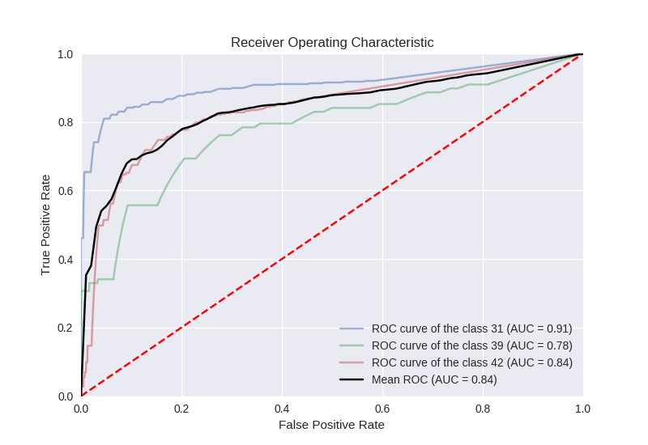
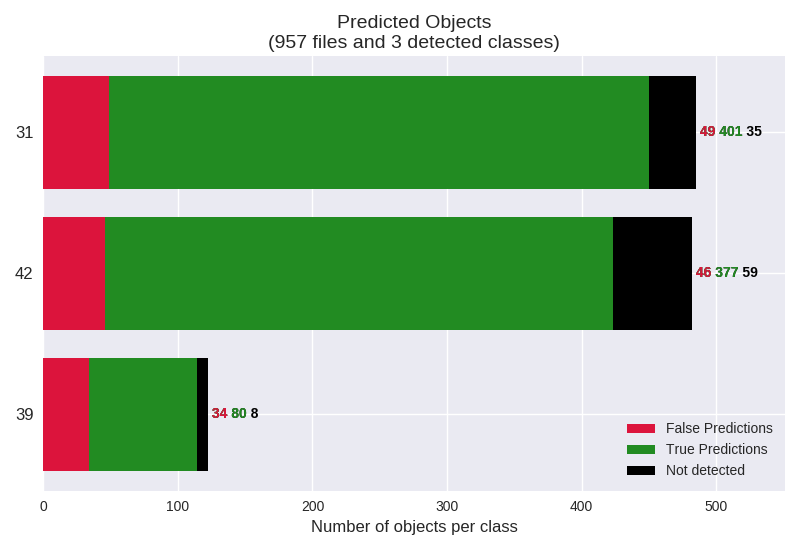

# mAP, predictions and ROC

This code will evaluate the performance of your neural net for object detection and/or recognition.

**This fork extends the evaluation for ROC curves and False negatives calculation**.

ROC (for each class and mean ROC of all classes together with calculated AUC):

Predicted (TP,FP,TN) extended for True negatives:
